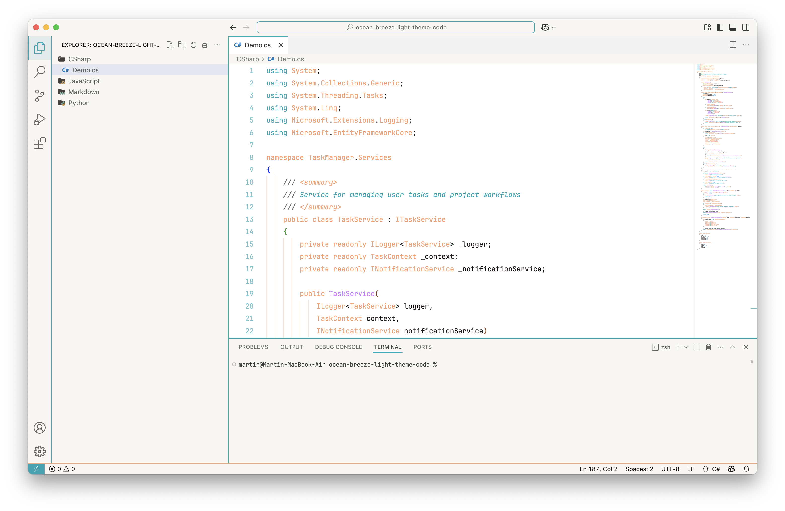
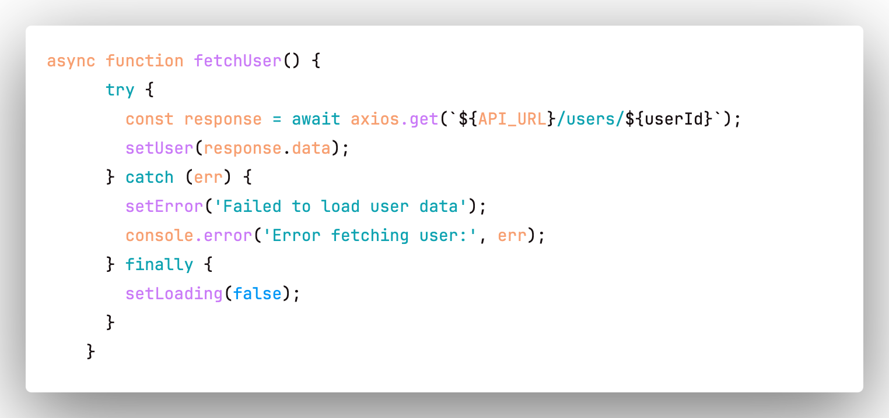
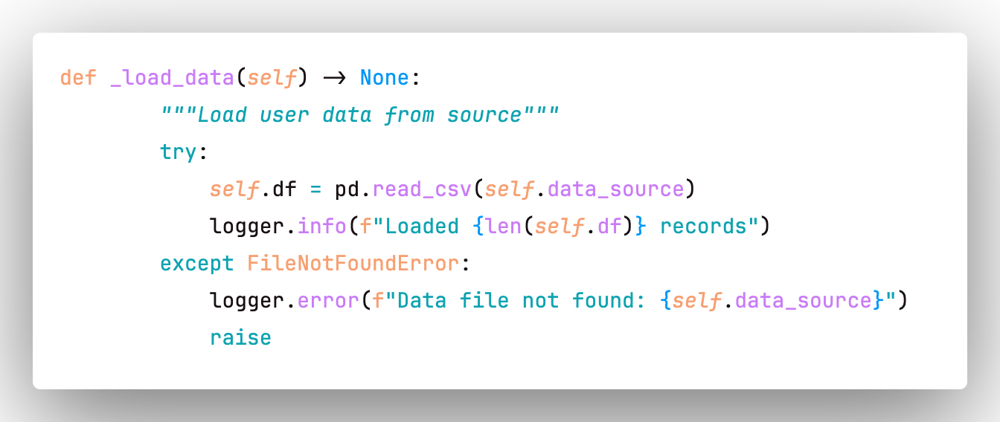
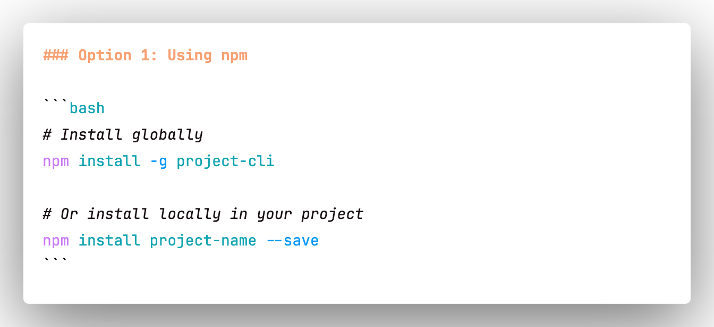

# Ocean Breeze Light Theme

A beautiful light theme for Visual Studio Code with ocean-inspired colors featuring teal, warm orange, and soft purple accents.

## Features

- 🌊 **Ocean-inspired color palette** with calming teal and warm accent colors
- 🎨 **Consistent design** across all VS Code UI elements  
- 📖 **Enhanced readability** with carefully chosen contrast ratios
- 🔧 **Modern language support** including TypeScript, React, Python, Rust, and more
- ♿ **Accessibility focused** with WCAG compliant color combinations
- 🎯 **Semantic highlighting** support for better code understanding

## Color Palette

| Color | Hex Code | Usage |
|-------|----------|--------|
| Ocean Teal | `#0fa3b1` | Primary accent, keywords, operators |
| Warm Orange | `#f7a072` | Variables, classes, HTML tags |
| Soft Purple | `#ca7bf7` | Functions, methods, links |
| Bright Blue | `#0197f6` | Constants, numbers, CSS values |
| Near Black | `#170f11` | Main text |
| Warm White | `#f9f7f3` | Backgrounds |

## Installation

### From VS Code Marketplace
1. Open VS Code
2. Go to Extensions (Ctrl+Shift+X)
3. Search for "Ocean Breeze Light Theme"
4. Click Install
5. Go to File > Preferences > Color Theme
6. Select "Ocean Breeze Light"

### Manual Installation
1. Download the `.vsix` file from releases
2. Open VS Code
3. Press Ctrl+Shift+P and type "Extensions: Install from VSIX"
4. Select the downloaded file

## Screenshots

### JavaScript/TypeScript

### Python

### Markdown

## Supported Languages

- JavaScript/TypeScript
- React/JSX
- Python
- Rust
- Java
- C/C++
- Go
- PHP
- HTML/CSS/SCSS
- Markdown
- JSON/YAML
- And many more!

## Contributing

Found a bug or want to suggest an improvement? Please open an issue or submit a pull request on [GitHub](https://github.com/creativwork/ocean-breeze-light-theme).

## License

MIT License - see [LICENSE](LICENSE) for details.

## Changelog

See [CHANGELOG.md](CHANGELOG.md) for version history.

---

Made with 💙 by [Martin Matanovic](https://github.com/creativwork)